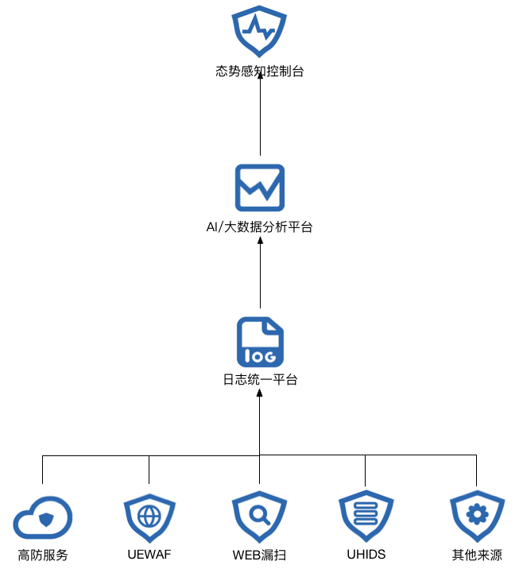

{{indexmenu_n>2}}

# 架构和原理简介

用户使用态势感知时，将会实时的从用户已购买的其他安全产品获得日志，进入态势感知日志统一平台，经过大数据分析和挖掘后，在前端控制台显示结果。

大数据分析的目的有：

``` 
  溯源：通过不同的攻击行为日志，找出攻击源（通常攻击者会使用不同的攻击手段进行攻击）；
  安全情报分析：找到攻击源后，结合网上已公布的攻击源或其他安全厂商的安全情报分析，对攻击源的威胁程度进行评估分析；
  趋势统计：对攻击记录进行统计分析，得出攻击趋势；
  威胁预测：对未来的安全威胁发出预警。
```



态势感知汇总了所有安全产品的动态信息，从态势感知中可以看到当前最需要关注的风险是什么。从网络、主机、应用三个不同的维度查看整体的安全状态。
